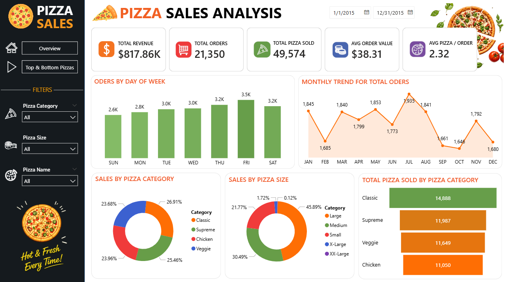

# Pizza-Sales-Analysis-Dashboard-Power-BI

This Power BI dashboard provides a comprehensive analysis of pizza sales performance using interactive visualizations. It helps business users understand sales trends, customer ordering behavior, product performance, and key business metrics to support data-driven decision-making.

---

# 📊 Dashboard Preview

## 🏠 Overview Dashboard



### Key KPIs

- 💰 Total Revenue
- 🛒 Total Orders
- 🍕 Total Pizzas Sold
- 📈 Average Order Value
- 🍽 Average Pizzas per Order

### Visualizations

- Orders by Day of Week
- Monthly Order Trend
- Sales by Pizza Category
- Sales by Pizza Size
- Total Pizza Sold by Category
- Interactive Filters
  - Pizza Category
  - Pizza Size
  - Pizza Name
  - Date Range

---

## ⭐ Top & Bottom Pizza Analysis


### Top 5 Analysis

- Top 5 Pizzas by Revenue
- Top 5 Pizzas by Quantity Sold
- Top 5 Pizzas by Number of Orders

### Bottom 5 Analysis

- Bottom 5 Pizzas by Revenue
- Bottom 5 Pizzas by Quantity Sold
- Bottom 5 Pizzas by Number of Orders

---

# 📈 Business Insights

This dashboard helps answer questions such as:

- Which pizza generates the highest revenue?
- Which pizzas are ordered most frequently?
- Which pizza categories perform best?
- Which pizza sizes are most popular?
- Which days receive the highest number of orders?
- What are the monthly sales trends?
- Which products need improvement due to low sales?

---

# 🛠 Tools & Technologies

- Power BI Desktop
- Microsoft Excel
- SQL (Data Preparation)
- DAX
- Power Query

---

# 📂 Project Structure

```
Pizza-Sales-Analysis/
│
├── Pizza Sales Dashboard.pbix
├── Pizza Sales Dataset.xlsx
├── Overview.png
├── Top & Bottom Pizzas.png
└── README.md
```

---

# 📊 Dashboard Features

✅ Interactive Filters

✅ KPI Cards

✅ Dynamic Charts

✅ Drill-down Analysis

✅ Category-wise Sales Analysis

✅ Monthly Trend Analysis

✅ Top & Bottom Product Analysis

---

# 🎯 Skills Demonstrated

- Data Cleaning
- Data Modeling
- Power Query
- DAX Measures
- KPI Design
- Dashboard Design
- Business Intelligence
- Data Visualization
- Report Development

---

# 📷 Dashboard Screenshots

### Overview


### Top & Bottom Analysis


---

# 🚀 How to Use

1. Clone this repository.
2. Open the `.pbix` file using Power BI Desktop.
3. Refresh the dataset if required.
4. Explore the interactive dashboard using slicers and filters.

---

# 📬 Connect With Me

**LinkedIn:** https://www.linkedin.com/in/your-linkedin/

**GitHub:** https://github.com/your-username

---

## ⭐ If you found this project useful, don't forget to Star the repository!
